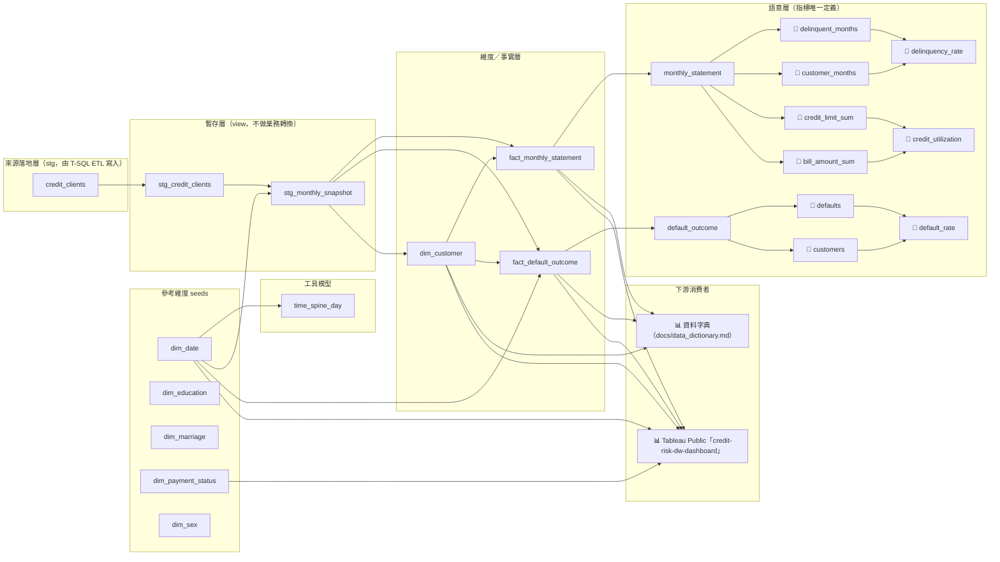

# 資料血緣

> 本檔由 `tools/lineage_md.py` 從 `dbt/target/manifest.json` 產出，**請勿手改**；
> CI 以 `--check` 比對，模型或 exposure 一改、文件沒重產就紅燈。
> 血緣的來源是 `ref()`／`source()` 依賴與 `exposures.yml` 宣告——推導出來的，不是畫出來的。

## 血緣圖

## 變更影響（改了左邊，右邊會受影響）

| 節點 | 層 | 直接下游 |
|---|---|---|
| `credit_clients` | source | stg_credit_clients |
| `dim_date` | seed | credit_risk_dashboard, fact_default_outcome, stg_monthly_snapshot, time_spine_day |
| `dim_education` | seed | — |
| `dim_marriage` | seed | — |
| `dim_payment_status` | seed | credit_risk_dashboard |
| `dim_sex` | seed | — |
| `stg_credit_clients` | staging | stg_monthly_snapshot |
| `stg_monthly_snapshot` | staging | dim_customer, fact_default_outcome, fact_monthly_statement |
| `time_spine_day` | utilities | — |
| `dim_customer` | marts | credit_risk_dashboard, data_dictionary, fact_default_outcome, fact_monthly_statement |
| `fact_default_outcome` | marts | credit_risk_dashboard, data_dictionary, default_outcome |
| `fact_monthly_statement` | marts | credit_risk_dashboard, data_dictionary, monthly_statement |
| `bill_amount_sum` | semantic | credit_utilization |
| `credit_limit_sum` | semantic | credit_utilization |
| `credit_utilization` | semantic | — |
| `customer_months` | semantic | delinquency_rate |
| `customers` | semantic | default_rate |
| `default_outcome` | semantic | customers, defaults |
| `default_rate` | semantic | — |
| `defaults` | semantic | default_rate |
| `delinquency_rate` | semantic | — |
| `delinquent_months` | semantic | delinquency_rate |
| `monthly_statement` | semantic | bill_amount_sum, credit_limit_sum, customer_months, delinquent_months |
| `credit_risk_dashboard` | exposure | — |
| `data_dictionary` | exposure | — |

## 業務指標的唯一定義（`dbt/models/marts/_semantic.yml`）

| 指標 | 分子 | 分母 |
|---|---|---|
| 額度使用率 (`credit_utilization`) | `bill_amount_sum` | `credit_limit_sum` |
| 違約率 (`default_rate`) | `defaults` | `customers` |
| 逾期率 (`delinquency_rate`) | `delinquent_months` | `customer_months` |

